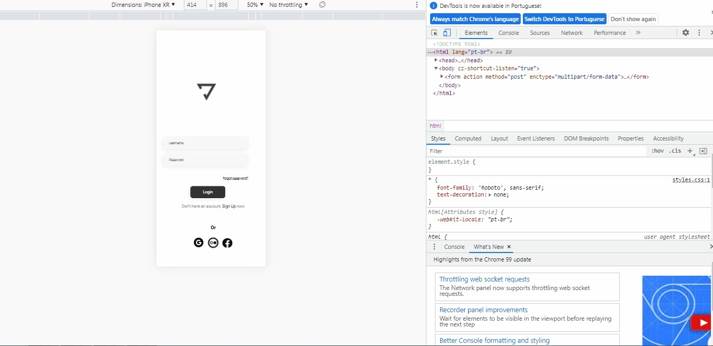

# Login_Yoga
Projeto de tela de login de app de Yoga responsiva, criada com CSS e HTML.
## 🔧 Função
Treinar CSS e HTML

## Veja o desenvolvimento do projeto:

Para ver o desenvolvimento acesse o planejamento:

## Feito Com:

### Support Ou Contato

Copyright © 2022 Julilana
